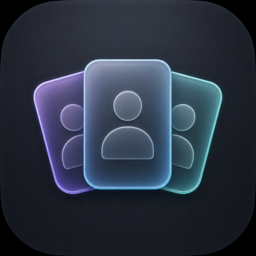

  

# AgentDock

AgentDock is a native macOS app for running multiple isolated profiles of the
official OpenAI Codex and Anthropic Claude desktop apps. Each profile receives
separate application state, can run alongside the stock app and other profiles,
and can have its own Dock-pinnable shortcut.

[Download the latest notarized release](https://github.com/euforicio/AgentDock/releases/latest)
· [Visit the website](https://euforicio.github.io/AgentDock/)
· [Read the documentation](docs/index.md)
· [Report a bug](https://github.com/euforicio/AgentDock/issues/new?template=bug_report.yml)
· [Contribute](CONTRIBUTING.md)
· [Security](SECURITY.md)
· [License](LICENSE)

> [!IMPORTANT]
> AgentDock isolates supported application state; it is not an operating-system
> sandbox. Managed instances retain normal access to your files, shell,
> network, Keychain, Git configuration, and SSH credentials.

## Highlights

- Run multiple app profiles side by side with separate local state.
- Open or focus the normal official installation independently of managed
  profiles.
- Focus and close an exact profile without quitting another running instance.
- Install native, profile-specific shortcuts under
  `~/Applications/AgentDock/`.
- Check for, download, and install signed AgentDock updates with Sparkle.
- Browse supported local chat histories with safe links, tables, selectable
  prose, syntax-highlighted code, and bounded tool output.
- View supported local activity, storage, usage-limit, and lifecycle
  information.
- Verify official app identity and code signatures before managed operations.
- Preserve profile data by default when removing a profile from the app.

## Requirements

- An Apple silicon Mac running macOS 26 or newer.
- The official Codex app, the official Claude app, or both.
- Swift 6.2 or newer only when building from source.

AgentDock does not redistribute or modify either provider app. If an app is not
installed in `/Applications`, select its signed `.app` bundle in AgentDock
settings.

## Install

1. Download the DMG from the
   [latest release](https://github.com/euforicio/AgentDock/releases/latest).
2. Open it and drag AgentDock onto the Applications shortcut.
3. Launch AgentDock. The release is Developer ID signed, hardened, notarized,
   and stapled for Gatekeeper verification.

AgentDock releases that include Sparkle update themselves from the signed
stable appcast. Installations from before Sparkle support require this one
final manual download; automatic updates begin after that version is installed.

Release pages also provide a ZIP and SHA-256 checksums. See
[Release operations](docs/operations.md) for verification and maintainer
release procedures.

## Quick Start

1. Open AgentDock and choose **Add Profile**.
2. Select the provider and give the profile a descriptive name.
3. Select the profile and choose **Open**.
4. Sign in inside that managed provider window.
5. Optionally choose **Install Shortcut** for a Dock-pinnable launcher.
6. Repeat for another account or provider.

The action changes to **Focus** while a profile is running. **Close** targets
only the selected profile. **Remove From List** preserves its local data;
permanent deletion is a separate confirmed action.

## Local Data and Privacy

AgentDock is local-first. It does not provide cloud synchronization or upload
managed profile data. Pseudonymous product analytics are enabled by default
and can be disabled immediately in Settings. They never
include profile, account, path, command, prompt, chat, transcript, session,
configuration, log, or crash content. AgentDock stores profile metadata and indexes under
`~/Library/Application Support/AgentDock/` and creates shortcuts under
`~/Applications/AgentDock/`.

Local transcript support is source-dependent:

- Codex uses supported local databases and session JSONL fallbacks.
- Claude uses supported local Cowork/agent-session data. The Official Claude
  view can also include the lightweight Claude Code history index and matching
  local session files.
- Ordinary synced claude.ai web chats are unavailable because Claude Desktop
  does not expose a stable local transcript contract. AgentDock does not scrape
  cookies or browser caches.

Indexes contain bounded list metadata, not full transcript bodies or absolute
working directories. See [Security and privacy](docs/security.md),
[Data flows](docs/data-flows.md), and the exact optional
[Product analytics event catalog](docs/analytics.md).

## Documentation

- [Documentation index](docs/index.md)
- [Architecture](docs/architecture.md)
- [Code map](docs/code-map.md)
- [Data flows](docs/data-flows.md)
- [Interfaces and contracts](docs/apis.md)
- [Development and testing](docs/development.md)
- [Release operations](docs/operations.md)
- [Security and privacy](docs/security.md)

## Contributing and Support

Bug reports, focused fixes, tests, documentation improvements, and feature
proposals are welcome. Start with:

- [Contributing guide](CONTRIBUTING.md)
- [Support guide](SUPPORT.md)
- [Security policy](SECURITY.md)
- [Issue tracker](https://github.com/euforicio/AgentDock/issues)

Please do not post credentials, account data, private transcript content,
absolute home-directory paths, or unredacted logs in public issues or pull
requests.

## Project Status

AgentDock is an early release. Provider integration is version-sensitive and
fails closed when a signed installed app no longer exposes its expected local
launch contract. Existing shortcuts may need to be reinstalled after launcher
or profile-identity changes.

AgentDock is an independent project. It is not an OpenAI or Anthropic product.

## License

AgentDock is licensed under the
[Functional Source License 1.1 with an MIT future grant](LICENSE). The MIT grant
becomes effective on July 29, 2028. Until then, the FSL permitted-purpose and
competing-use restrictions apply.

The vendored Streamdown subset retains its own FSL-1.1-MIT license and its
separate March 16, 2028 MIT grant date in
[`Vendor/streamdown-swift/LICENSE`](Vendor/streamdown-swift/LICENSE).
See [Third-party notices](THIRD_PARTY_NOTICES.md) for dependency licenses.
